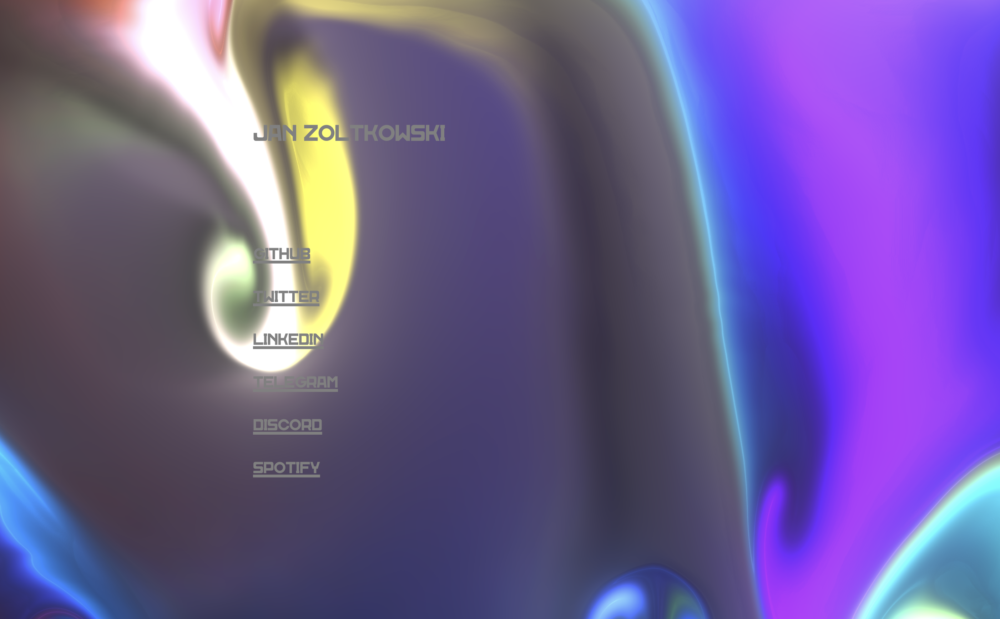

a tiny, almost-unopinionated [Astro](https://astro.build/) starter for your next blog, documentation, personal/marketing website, and more.

it comes with the [CUBE CSS](https://cube.fyi/) file structure, a methodology for managing stylesheets efficiently no matter the size of the project.

the project is mostly barebones, the goal isn't to provide a batteries-included template, just an easy starter kit and stylesheets to copy/paste from.

most styles are for demo purposes and to explain the underlying philosophy: "Be the browser's mentor, not its micromanager" (see [buildexcellentwebsit.es](https://buildexcellentwebsit.es)).

## features

- **[CUBE CSS](https://cube.fyi/) implementation**: take a look at the docs, they are concise and explain way better than i would
- **fluid and responsive**: it looks great no matter the device size
  - [Every Layout](https://every-layout.dev/) examples for layout elements
  - [Utopia](https://utopia.fyi/) for fluid `clamp()`-based font sizes and spacing
- **lightweight**: 💯 [lighthouse score](https://developer.chrome.com/en/docs/lighthouse/performance/performance-scoring/) across the board — not surprising considering the size of the project, but worth mentioning
- **dark-mode ready**: implement your own theme switcher if you're into that sort of thing, all you have to do is toggle the `data-theme` attribute on the body
- **SEO** ready: basic SEO meta-tags are set-up, with `sitemap`s automatically generated at build time

## installation

### clone this repo

```bash
git clone 
```

### instal dependencies

```bash
cd astro-cube
```

```bash
npm i
```

### spin up local dev server

```bash
npm run dev
```

### build to `./dist/`

```bash
npm run build
```

### preview production build

```bash
npm run preview
```

### ...or use the template directly ➡️ "Use this template" > "Create a new repository"

